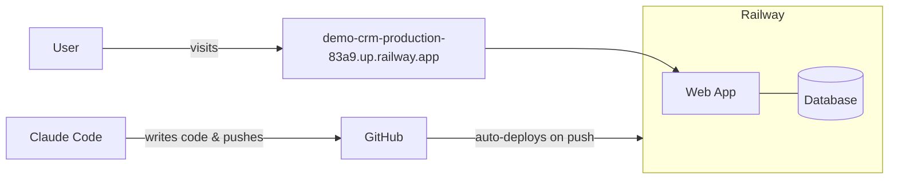

# Demo CRM — Deployment Architecture



## Flow

1. **Claude Code** writes the app and pushes it to **GitHub**.
2. **GitHub** notifies **Railway** of the push.
3. **Railway** rebuilds and runs the web app, which talks to its database.
4. The **user** visits the public URL and uses the app.

---

# How This Was Set Up

A walkthrough of the steps used to build and deploy this CRM, in case you want to repeat the process for another project.

## What you need before starting

- A folder for your project
- An account on **GitHub** (free)
- An account on **Railway** (Hobby plan, ~$5/month)
- **Claude Code** to drive the build

## The steps

### 1. Build the app locally

In Claude Code, ask it to scaffold the app — for example:

> "Build a fully functioning CRM in this folder with contacts, companies, and analytics pages. Use a real database. Make it deployable to Railway."

Claude generates the code, sets up the database schema, and creates a seeder for mock data.

### 2. Push to GitHub

Claude uses the GitHub CLI (`gh`) to create a private repo and push the code. You only need to be logged in to GitHub once on your machine — after that Claude can create repos and push for you.

### 3. Set up Railway

Install the Railway CLI and run `railway login` once in your own terminal. After that, Claude can:

- Create a new Railway project
- Add a PostgreSQL database
- Create a web service for the app
- Set environment variables (database URL, seed token)

### 4. Connect GitHub to Railway

This is the one step you do in the browser:

1. Go to your Railway account settings → connect your GitHub account.
2. Open your Railway project → click the web service → **Settings → Source → Connect Repo** → pick your repo.

From now on, every push to `main` automatically triggers a Railway deploy.

### 5. Generate a public URL

Claude runs `railway domain` to give the app a public address (something like `your-app.up.railway.app`).

### 6. Seed the mock data

Claude runs a one-time seed script (`npm run db:seed`) against the deployed database to fill it with realistic mock companies, contacts, and deals.

### 7. Done

Open the URL in any browser — your CRM is live on the internet.

## A couple of gotchas

- **GitHub authorization is two-part.** Installing the Railway GitHub App on a repo gives Railway access to the *code*, but Railway also needs your GitHub *identity* connected at the account level (Account Settings → Connected Accounts). Both are required.
- **Railway scans for security vulnerabilities at build time.** If a dependency has a known CVE, the deploy is blocked. Bump the package and push again.
- **Free trial only allows one service per project.** Since the database counts as a service, you need the Hobby plan ($5/month) to add a web service alongside it.

## Recurring workflow after setup

Once everything is wired up, the day-to-day is just:

```
edit code → git push → Railway auto-deploys → visit your URL
```

No CLI gymnastics needed for normal changes.
